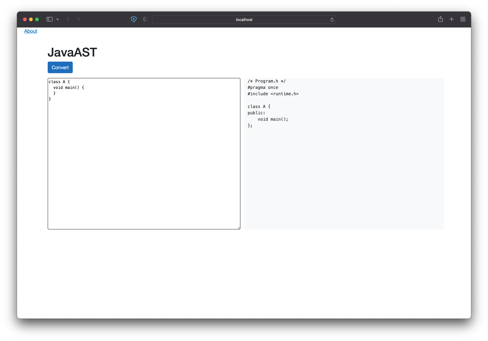

# Java to c++ test

A basic Antlr that traverses Antlr4 parse tree and generates reflection data from parsed code. Basic C++ code generator is included. 

Additionally has Blazor Wasm UI playground for displaying transformed Java to C++ source.
